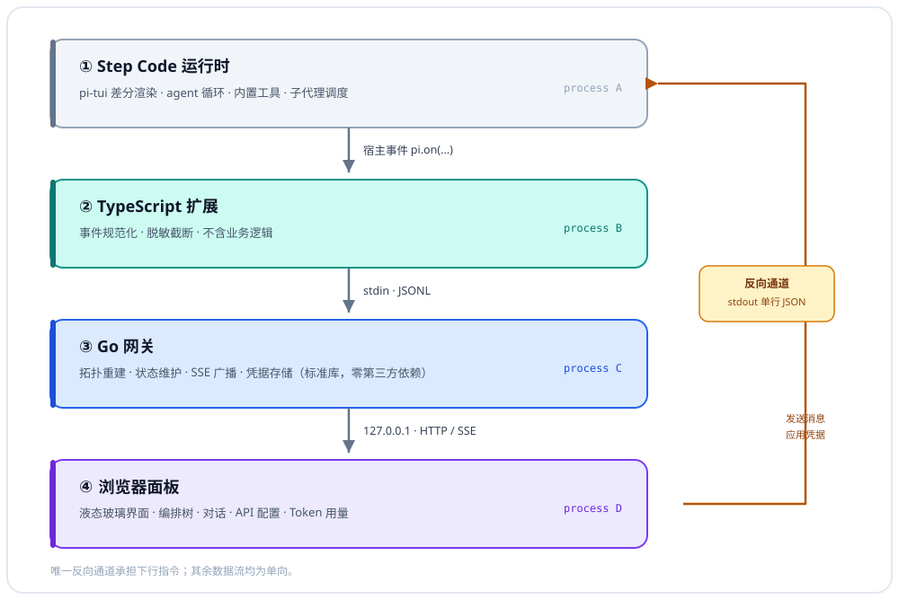

# StepFun Code-GUI

**v1.0.0** · [简体中文](README.md) | [English](README.en.md)

Step Code 的子代理编排可视化面板。终端中运行的 `subagent` / `workflow` 编排，
以液态玻璃界面在浏览器中实时呈现。

> 内部包名为 `step-orchestra`；仓库与产品名称为 StepFun Code-GUI。



---

## 架构设计依据

Step Code 的 UI 层为 `pi-tui`，采用终端字符差分渲染，插件不具备注入自定义图形组件的公开 API；
终端亦无法呈现真实的模糊与折射效果。基于此约束，系统按职责划分为四个进程：

| 层 | 职责 |
|---|---|
| TypeScript 扩展 | 将宿主事件规范化为 JSONL 并写入子进程 stdin，不含业务逻辑 |
| Go 网关 | 重建拓扑、维护状态，并通过 SSE 推送 |
| 浏览器面板 | 承担全部图形渲染与动效 |
| 反向通道 | 经网关 stdout 回传指令，用于发送消息与应用凭据 |

该分层的主要收益在于变更隔离：宿主 API 调整仅影响 `extensions/` 目录，
且面板可脱离 Step Code 独立开发与调试。

---

## 快速开始

```bash
# 1. 构建 Go 网关（产物约 10 MB，自包含，无运行时依赖）
cd gateway
go build -o ../bin/step-orchestra-gateway .      # Windows 平台需附加 .exe

# 2. 本地端到端验证（无需安装 Step Code）
node tools/mock-feed.mjs

# 3. 如需手动查看面板
node tools/mock-feed.mjs --serve
```

`mock-feed.mjs` 回放一组完整场景（一次 workflow 并行扇出与一次 subagent 串行链），
随后自动请求 `/api/snapshot` 执行断言并输出结果。

---

## 安装到 Step Code

```bash
step install /absolute/path/to/step-orchestra
step list
```

安装完成后，在 Step Code 中执行 `/orchestra`，将输出面板地址：

```
[step-orchestra] panel http://127.0.0.1:47810/?t=<token>
```

网关随扩展加载自动启动，并在会话结束时退出，无需额外配置。

### 包结构

`package.json` 通过 `"pi": { "extensions": ["extensions/index.ts"] }` 声明入口
（对应官方 `with-deps` 示例的写法；**顶层** `extensions` 字段宿主不予识别）。

`step install` 将来源写入 `~/.stepcode/config.toml`：

```toml
# StepCode configuration
packages = [ "E:\\Project\\...\\step-orchestra" ]
```

> 官方文档描述为 `~/.stepcode/agent/settings.json`，实测 0.1.1 版本写入
> `~/.stepcode/config.toml`。以 `step list` 的输出为准。

亦可绕过安装流程，使用 `step -e <入口路径>` 临时加载。

---

## 事件契约

扩展订阅以下宿主事件（`pi.on(event, handler)`），字段定义以 `extensions/types.ts` 为准。

| 宿主事件 | 用途 |
|---|---|
| `session_start` | 会话元信息（ID / cwd / 模型） |
| `agent_start` / `agent_end` / `agent_settled` | 轮次与整体结算 |
| `tool_call` | 节点创建；`subagent` / `workflow` 标记为编排节点并提取模式 |
| `tool_execution_update` | **编排进度的主数据源**。0.1.1 载荷位于 `event.partialResult`，0.84.x 位于 `event.details`，两者均予解析 |
| `tool_result` | 节点终态、耗时、token 用量 |
| `message_start` / `message_update` / `message_end` | 对话流：取 `assistantMessageEvent.text_delta` 累积为流式气泡 |
| `session_shutdown` | 关闭网关 |

`message_update` 按 token 触发，仅取 `assistantMessageEvent.type === "text_delta"` 的增量；
thinking 与 toolcall 增量不予转发，因其已以工具节点的形式呈现。

### 上游健壮性

`extensions/progress.ts` 为每个计数字段维护一份**别名表**
（如 `running` 对应 `running` / `runningCount` / `active` / `activeCount`），
并在 `partialResult` / `progress` / `workflowProgress` / `snapshot` / `details`
等包装层下钻至多三层。宿主重命名字段时降级为**部分读取**，而非整块面板空白。

上游版本间存在实测差异：

| 项 | 0.1.1 | 0.84.x |
|---|---|---|
| 进度载荷字段 | `event.partialResult` | `event.details` |
| `subagent` 工具 | 由示例扩展提供，参数为 `{agent\|tasks\|chain}` | 内置，另有 `workflow` 工具 |
| 安装配置落点 | `~/.stepcode/config.toml` | 文档称 `settings.json` |
| 包入口声明 | `"pi": { "extensions": [...] }` | — |

因此 `inferMode()` 依据**参数形状**推断扇出模式：存在 `chain` 数组判定为 chain，
存在 `tasks` 数组判定为 parallel，存在 `agent` 或 `task` 判定为 single，
不依赖显式的 `mode` 字段。

---

## 安全设计

| 项 | 措施 |
|---|---|
| 网络暴露 | 仅绑定 `127.0.0.1`，端口冲突时自动顺延（至多 12 次） |
| 鉴权 | 每次运行生成 24 字节随机 token，`/events` 与 `/api/snapshot` 均予校验，采用常数时间比较 |
| 凭据泄露 | 参数经 `redact.ts` 处理：`key` / `token` / `secret` / `password` / `authorization` / `cookie` 等键整值替换为 `***` |
| 体积膨胀 | 单字符串截断至 2048 字符，每层至多 24 个键，递归深度上限为 4 |
| 注入 | 前端一律以 `textContent` 写入宿主数据；`innerHTML` 仅用于本文件内声明的静态图标路径 |
| 数据落盘 | 不写入任何文件；token 仅在扩展内存中流转 |

---

## 对话模式与视图切换

面板包含两个视图：**编排**（工具与子代理拓扑）与**对话**（与 agent 的交互）。
二者在同一 grid 单元格内常驻挂载，切换操作仅翻转可见性。

### 切换按钮

| 项 | 设计 |
|---|---|
| 位置 | topbar 右端、连接状态指示灯左侧，属全局视图控件，不隶属任一列面板 |
| 文案 | 显示**目标模式**：编排视图下显示「对话」，对话视图下显示「编排」 |
| 图标 | 与文案联动，目标为对话时显示气泡，目标为编排时显示节点图；由 CSS 依据 `data-target` 切换，不替换 DOM |
| 悬停 | 上浮 1 px、描边转主题紫、玻璃高光增强（240 ms） |
| 按下 | `scale(0.972)`，过渡压缩至 90 ms |
| 焦点 | `:focus-visible` 2 px 紫色外圈，支持键盘可达 |
| 过渡中 | `aria-busy="true"` 配合 `pointer-events: none`，在 240 ms 窗口内抑制重复触发 |
| 禁用 | 事件流断开时禁止切换（`opacity: .45`、`cursor: not-allowed`、无悬停反馈） |

### 切换过程的稳定性保障

| 风险 | 处理 |
|---|---|
| 布局跳动 | 两视图共享同一 `grid-area: stage` 单元格重叠，容器尺寸恒定 |
| 重建闪烁 | 视图**不卸载**，切换仅改变 `opacity` 与 `visibility` |
| 滚动丢失 | DOM 存活，编排树与对话的滚动位置原样保留 |
| 选中丢失 | 选中节点为 DOM 属性，不随切换变化 |
| 草稿丢失 | 输入框 DOM 存活，切换后内容与光标位置均保留 |
| 数据重载 | 切换**不发起任何请求**；SSE 持续写入两个视图 |
| 动画竞态 | 240 ms `aria-busy` 窗口抑制重复触发；`prefers-reduced-motion` 下过渡降至 0.01 ms |

### 对话数据流

```
输入框 ──POST /api/send──▶ 网关 ──stdout 单行 JSON──▶ 扩展 ──pi.sendUserMessage()──▶ 宿主
宿主 ──message_start/update/end──▶ 扩展（累积 text_delta）──▶ 网关 ──SSE──▶ 气泡原地更新
```

上述反向通道为系统内唯一的下行路径：stdin 承载上行事件，stdout 承载下行指令。

发送按钮的禁用条件为复合判定：输入为空、agent 处于忙碌状态（`ctx.isIdle()` 为 false）、
或事件流断开。agent 忙碌时发送不会失败，扩展将自动降级为 `deliverAs: "followUp"` 排队等待。

消息气泡按 id 复用 DOM，流式更新仅修改文本节点，不重建列表。滚动采用贴底策略
（距底部不足 72 px 时自动跟随，否则显示「回到底部」按钮），避免打断向上翻阅。

---

## API 配置切换

支持在多个账户的 coding Plan 之间切换，无需重启。

### 配置存储

| 项 | 决定 |
|---|---|
| 位置 | `~/.stepcode/agent/step-orchestra/profiles.json`（由网关写入） |
| 权限 | 目录 `0700`、文件 `0600`；Windows 平台为尽力而为，由 ACL 兜底 |
| 原子性 | 先写入 `.tmp` 再 rename，崩溃不会截断原文件 |
| 格式 | `{ version, activeId, profiles: [{ id, name, provider, apiKey, baseUrl?, addedAt }] }` |
| 加密 | **不加密**。与 `.netrc`、`~/.aws/credentials` 采取同级做法：明文存储并依赖文件权限 |
| 浏览器 | **不接触明文**。列表接口仅返回 `keyHint`（形如 `sk-m…7890`） |

选择由网关持有明文，而不使用浏览器 localStorage：localStorage 对同源脚本完全可读，
而面板本身运行于 localhost，将密钥置于浏览器等同于交付给任意注入脚本。

### 切换的即时生效机制

Step Code 的凭据经由 model registry 解析。官方文档明确：`registerProvider`
在初始加载阶段之后调用**立即生效，无需 `/reload`**；且配置形式仅覆盖传入字段，
模型目录保持不变。

```
点击切换 → POST /api/profiles/activate → 网关写 activeId
        → stdout 下发 action{apply_profile, profile}
        → 扩展 pi.registerProvider(provider, { apiKey })
        → 下一个请求即使用新凭据
```

由于仅传入 `apiKey`（及可选的 `baseUrl`），该 provider 的模型列表不会被重置。

### 失效检测

不主动探测端点，而是**监听真实流量**：扩展订阅 `after_provider_response`，
收到 401 / 403 时广播 `profile_status`，面板将当前配置标红并给出原因。
该方案不产生额外请求与计费。

表单侧的静态校验：名称与 provider 为必填；新增时密钥为必填；
密钥长度不足 12 字符标记为「长度异常」。

### 交互设计

| 元素 | 行为 |
|---|---|
| 触发按钮 | topbar 右侧，位于 metrics 与「对话」切换键之间；含状态点、账户名与掩码密钥 |
| 状态点 | 绿色为可用；灰色为缺少密钥；琥珀色为长度异常；红色为凭据被拒绝（含呼吸动画） |
| 展开 | 点击展开玻璃浮层，同步 `aria-expanded`，箭头翻转 |
| 关闭 | 点击外部、按 Esc，或再次点击 |
| 列表项 | 名称 +「当前」徽标 + provider / 掩码 / baseUrl + 状态描述；当前项不可重复点击 |
| 行内操作 | 编辑、删除；删除经由原生 `confirm` 二次确认 |
| 悬停 / 按下 | 与模式切换键一致：上浮 1 px / `scale(0.978)` |
| 编辑 | 密钥留空即保留原值（由服务端合并），浏览器无需回填未曾获得的密钥 |

---

## Token 用量显示

位于对话视图底部、输入框上方的单行指标文本，形式参照
[`Neriah-Ado/stepfun-usage-monitor`](https://github.com/Neriah-Ado/stepfun-usage-monitor)
的回复底部指标行。

```
537.3 tok/s · 首字 3.0s · 输出 223 tok / 生成 0.4s · 均值 494.9 · 累计 51.3k tok · 上下文 168k/200k · 接近上限 · 10:23:04
```

| 项 | 设计 |
|---|---|
| 形态 | **单行纯文本**、等宽字体、中点分隔；无进度条与独立面板背景 |
| 位置 | 对话日志与 composer 之间，归属输入区 |
| 时机 | `message_end`；数值仅在响应落地时变化，不轮询、不随 token 抖动 |
| 数字规则 | **双轨制**：精确值采用千分位（`2,762`）；累计值采用紧凑单位 —— 小于 1k 保留原值、1k 至 10k 保留一位小数（`9.8k`）、10k 至 1M 取整（`51k`）、不小于 1M 保留一位小数（`73.8M`） |
| 时刻 | 右对齐、等宽，不参与文本截断 |
| ≥75% / ≥92% | 整行转琥珀色 / 红色，并追加「接近上限」/「即将溢出，建议 /compact」 |

### 速率的计算方式

扩展层可用的时钟仅为事件到达时间戳，因此：

```
TTFT      = 首个 text_delta 到达 − message_start
生成耗时   = 最后一个 text_delta − 第一个 text_delta
tok/s     = 本轮输出 token ÷ 生成耗时 × 1000
```

两处保守处理：生成窗口短于 200 ms 或长于 1 h 的样本不计入滑动平均（属噪声而非吞吐）；
仅存在单个 delta 时 `generationMs` 记为 `null` 而非 0，避免前端得出异常数值。
TTFT 包含 IPC 延迟，读数偏高，作为仪表指示可接受。

### 「上下文占用」字段的保留依据

参照项目呈现的是**速率**，而本项目所需的上下文占用是**窗口余量**，两者语义不同。
因此实现采取融合方案：形式与数字规则沿用参照项目，字段以速率类为主，
同时保留上下文占用与告警 —— 因为「接近上限」是该行内唯一可行动的信号。

---

## 液态玻璃实现

| 层次 | 手段 |
|---|---|
| 折射底 | `backdrop-filter: blur(22px) saturate(175%)` |
| 玻璃体 | 142° 白色渐变 + 1 px 高光描边 + 四向 `inset` 阴影模拟厚度 |
| 镜面高光 | `radial-gradient` 跟随 `--gx` / `--gy`，由 `glass.js` 写入 |
| 立体感 | 卡片跟随 `--rx` / `--ry` 产生不超过 4.5° 的视差倾斜 |
| 液态形变 | 空状态光环应用 SVG `feTurbulence` 与 `feDisplacementMap` |
| 性能护栏 | rAF 合并指针事件；节点入场动画采用 `backwards` 而非 `both`（后者会锁定 `transform` 导致悬停失效）；`contain: layout paint` |
| 降级 | `@supports not (backdrop-filter)` 时降为高不透明纯色面板；`prefers-reduced-motion` 下关闭全部动效 |

> 真实折射需要扭曲背景内容，而 CSS 无法对 `backdrop` 施加位移滤镜。
> 因此折射感由高光、内阴影与倾斜共同营造；SVG 位移滤镜仅用于装饰性元素，以避免文字扭曲。

---

## 项目结构

```
step-orchestra/
├── extensions/          # Step Code 扩展（TypeScript，ESM，Node ≥ 22）
│   ├── index.ts         #   入口：事件订阅与转发
│   ├── bridge.ts        #   Go 子进程生命周期 + 反向通道解析
│   ├── conversation.ts  #   对话镜像：历史回放 / 流式累积 / 发送
│   ├── metrics.ts       #   回合计时与吞吐计算
│   ├── profiles.ts      #   凭据应用：registerProvider 热切换
│   ├── progress.ts      #   WorkflowProgress 防御式解析
│   ├── redact.ts        #   脱敏与截断
│   └── types.ts         #   线协议
├── gateway/             # Go 网关（标准库，零第三方依赖）
│   ├── main.go          #   stdin 读取 + HTTP/SSE + REST 端点
│   ├── state.go         #   拓扑状态机
│   ├── conversation.go  #   对话日志（有界、按 id 索引）
│   ├── profiles.go      #   凭据存储（原子写、掩码投影）
│   └── hub.go           #   SSE 广播
├── web/                 # 浏览器面板（零构建，原生 HTML/CSS/JS）
│   ├── liquid-glass.css #   设计系统 + 视图栈 + 切换按钮 + 配置面板
│   ├── glass.js         #   指针高光 / 视差倾斜
│   ├── tree.js          #   编排树渲染（增量复用）
│   ├── chat.js          #   对话视图（气泡复用 + 贴底滚动）
│   ├── profiles.js      #   API 配置选择器
│   └── app.js           #   SSE 客户端 + 模式切换 + 详情面板
├── docs/
│   └── architecture.svg #   架构图
└── tools/
    ├── mock-feed.mjs    # 端到端验证（编排 + 对话 + 反向通道 + 凭据 + 用量）
    ├── test-progress.mjs# 宿主载荷解析回归
    └── check-layers.mjs # 层叠关系静态校验
```

前端调试流程：执行 `node tools/mock-feed.mjs --serve`，修改文件后刷新浏览器即可生效，无需构建。

---

## 验证状态

| 项 | 状态 |
|---|---|
| 扩展被 Step Code 加载并执行 | 已实测（`step -e` 与自动发现两条路径） |
| 自动发现（`step install` → `config.toml`） | 已实测（`step list` 确认） |
| 扩展生命周期钩子 | 已实测（`session_shutdown` 后网关优雅退出，无残留进程） |
| 端口冲突自动避让 | 已实测（47810 被占用时顺延至 47811） |
| 网关与前端数据链路（编排 / 对话 / 反向通道 / 凭据 / 用量） | `tools/mock-feed.mjs` **33/33** 断言 |
| 宿主载荷解析 | `tools/test-progress.mjs` 11/11 断言 |
| 凭据持久化落盘 | 已实测，`profiles.json` 写入且包含密钥 |
| 明文密钥不外泄至浏览器 | 已实测，响应体不含明文 |
| 配置浮层层叠关系 | `tools/check-layers.mjs` 11/11（已验证该脚本可捕获原缺陷） |
| 反向通道鉴权（无 token 拒绝） | 已实测返回 401 |
| 真实 agent 事件流（tool_call / 消息流） | **未验证** —— 需登录后运行真实任务方可触发 |
| `registerProvider` 热切换实际生效 | **未验证** —— 需登录后观察下一个请求 |

### 层叠关系的复核方式

```bash
node tools/check-layers.mjs      # 静态判定，11 项断言
```

判据为纯静态：**后代元素无法越过其所属的层叠上下文根**。因此仅需校验
「`.topbar` 的 z-index 严格大于 `.stage`」这一不变量，即可保证嵌套于 `.topbar`
内的配置浮层不被内容区遮挡。该脚本在修复过程中经反向验证 ——
将 `z-index` 改回 `2` 会立即降至 9/11 并返回非零退出码。

面板上的手工确认方式：点击 topbar 的「配置」按钮，浮层应完整覆盖于编排树与对话区之上；
将窗口缩小至 1080 px 以下（`.stage` 切换为单列布局）后仍应保持该行为。

---

## 已知限制

- **真实 agent 事件流未验证。** `~/.stepcode/auth.json` 为空（未登录），
  且非 TTY 环境下 step 不建立真实会话，因此 `session_start` 与工具事件未实际触发。
  登录后执行一次 `subagent` 调用即可补齐该环节。
- **接口形状按 0.1.1 实测校准。** 若升级至 0.84.x，`partialResult` 将变为 `details`，
  `subagent` 可能转为内置工具并新增 `workflow`；解析层已同时兼容。
- **子代理明细为聚合数据。** 子代理运行于独立进程，主进程无法观测其内部工具调用，
  面板仅能呈现宿主在进度快照中给出的 agent 行。
- **扇出仅一层。** 此为 Step Code 的约束，因此树最深两层。
- **Windows 构建需附加 `.exe`。** `bridge.ts` 已按平台自动选择文件名。
- **端口固定于 47810–47821。** 全部占用时启动失败，并在 `/orchestra` 中给出原因。

---

## 故障排查

| 现象 | 处理 |
|---|---|
| `/orchestra` 提示 binary missing | 网关未构建，执行 `cd gateway && go build -o ../bin/step-orchestra-gateway .` |
| 面板持续显示「连接中」 | 检查 URL 中 `t` 参数是否完整；token 每次运行均会变化 |
| 节点未出现 | 确认触发的是 `subagent` / `workflow`；普通工具调用需关闭「仅编排」筛选 |
| 端口被占用 | 通过 `STEP_ORCHESTRA_PORT=50000` 环境变量覆盖起始端口 |
| 自定义网关路径 | 通过 `STEP_ORCHESTRA_BIN=/path/to/gateway` 环境变量覆盖 |

---

## 许可证

本项目采用 **GNU Affero 通用公共许可证第 3 版（AGPL-3.0-only）**，全文见 [LICENSE](LICENSE)。

选择该许可证的依据：本项目以网络服务形式交付（浏览器面板 + 本地 HTTP/SSE 网关），
而 AGPL-3.0 是主流许可证中唯一在**网络交互**场景下仍保持开源传染性的选择 ——
使用者即便仅通过网络访问本软件、而不分发任何二进制，仍须提供完整对应源码。

### 使用者义务

| 使用方式 | 义务 |
|---|---|
| 自行运行（含内部生产环境） | 无附加义务，可自由使用 |
| 分发本软件或其修改版 | 须以 AGPL-3.0 提供**完整对应源码**，保留版权与许可声明，并标明修改内容与日期 |
| 修改后分发 | 同上；修改部分同样受 AGPL-3.0 约束（copyleft 传染） |
| **以网络服务形式提供**（第 13 条） | 须向所有远程交互用户提供**获取对应源码的显著途径**，即使未分发二进制 |
| 集成进其他程序 | 若构成衍生作品，则整个作品须以 AGPL-3.0 授权 |
| 商业使用 | **允许**。可收费、可用于商业目的，但上述开源义务不因此豁免 |

### 主要限制

- 不得移除或规避版权与许可声明；
- 不得将衍生作品的许可证改为更宽松的条款；
- 不得附加与本许可证相冲突的进一步限制（GPLv3 第 10 条）；
- 违反许可证时授权自动终止，须由版权人恢复（第 8 条）。

### 与 GPL-3.0 的差异

AGPL-3.0 在 GPL-3.0 基础上增设第 13 条：**通过网络提供服务同样触发源码提供义务**。
本项目以浏览器经本地网络访问面板为核心使用方式，若采用 GPL-3.0，
使用者可仅提供服务而无需公开源码，因此选择 AGPL-3.0。

> 需要澄清的是：AGPL-3.0 允许商业使用。若目标是禁止他人商业使用，
> 该目标与开源定义不相容，须改用 PolyForm Noncommercial 等源码可得（source-available）许可证。

### 关于版权声明

仓库根部的 `LICENSE` 为唯一权威许可文本，各源文件未逐一附加版权头。
分发或修改时请在该处保留原始许可证，并按第 5(a) 条标明修改。
